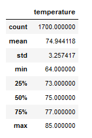
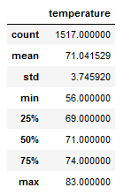

# surfs_up
## Overview
Fictional company Waves and Icecream wants to determine if opening a surf shop in Oahu, Hawaii has good business value.  Temperature data for the months of June and December were analysed to assist in determiniug if a surf and ice cream shop business is sustainable year-round.

## Resources
- Jupyter Notebook
- Python v3.x
  - Dependencies
    - Pandas
    - Numpy
    - SQLAlchemy
- [hawaii.sqlite](https://github.com/acfthomson/surfs_up/tree/main)

## Results
### June and December Findings
Using Python, Pandas , and SQLAlchemy, the date column of the Measurements table was filtered in the hawaii.sqlite database to retrieve all the temperatures for the months of June and December. Those temperatures were converted to a list, a DataFrame was created from those lists, and then summary statistics were generated for each dataset.

June statistics showed the following:

December statistics showed the following:

 - There was 12% more temperature points for June than there were for December.
 - The average temperature for December was 71 degrees, which is nearly four degrees cooler than June's average temperature of 74.9 degrees.
 - The maximum temperature for June was 85 degrees, which is only two degrees warmer than December's maximum temperature of 83 degrees
