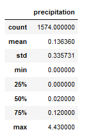
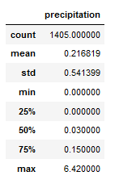

# surfs_up
## Overview
Fictional company Waves and Ice Cream wants to determine if opening a surf shop in Oahu, Hawaii has good business value.  Temperature data for the months of June and December were analyzed to assist in determining if a surf and ice cream shop business is sustainable year-round.

## Resources
- Jupyter Notebook
- Python v3.x
  - Dependencies
    - Pandas
    - Numpy
    - SQLAlchemy
- [hawaii.sqlite](https://github.com/acfthomson/surfs_up/tree/main)

## Results
### June and December Temperature Findings
Using Python, Pandas , and SQLAlchemy, the date column of the Measurements table was filtered in the hawaii.sqlite database to retrieve all the temperatures for the months of June and December. Those temperatures were converted to a list, a DataFrame was created from those lists, and then summary statistics were generated for each dataset.

June temperature statistics showed the following:

December temperature statistics showed the following:

Comparing the temperatures for the two months, we can see the following:
 - There were 12% more temperature points for June than there were for December.
 - The average temperature for December was 71 degrees, which is nearly four degrees cooler than June's average temperature of 74.9 degrees.
 - The maximum temperature for June was 85 degrees, which is only two degrees warmer than December's maximum temperature of 83 degrees

## Additional Analysis
### June and December Precipitation Findings
The process to acquire statistics on precipitation for June and December was the same as the process for finding temperature statistics.

June precipitation statistics showed the following:

December precipitation statistics showed the following:

 - Comparing the precipitation amounts for the two months, we can see the following:
  - There were 12% more precipitation points for June than there were for December.
  - The average precipitation amount for December was 0.22 inches, which is 0.08 inches more than June's average precipitation of 0.14 inches.
  - The maximum precipitation amount for June was 4.43 inches, which is close to 2 inches less than December's maximum precipitation amount of 6.42 inches.
 
